# "Tested with Atlas" badge kit

A badge a mod author can drop on a Mod DB page, a GitHub README or a forum post to say
their mod's tests run on Atlas. It says "tested with", not "powered by": Atlas is a test
harness that runs alongside `dotnet test`, not a runtime dependency the mod carries into
the game, and "powered by" would suggest otherwise to a player reading the page.

Five formats, three palettes, each shipped as `.svg` and as `.png` at 1x and 2x. Every
badge has its own opaque ground and a thin edge, so it reads on any page background.
Everything is generated by `generate.py`, the same approach as `docs/assets/moddb`: the
titan mark is copied as vector paths straight out of the repository's own
[`docs/assets/logo.svg`](../logo.svg), and the wordmarks are set in Noto Serif then baked
to outline paths, so the shipped `.svg` files carry no `<text>` and render identically on
every viewer.

## Gallery

| Format | sepia | classic | dark |
| --- | --- | --- | --- |
| flat, 159x20 | 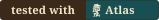 |  |  |
| plaque, 220x60 | 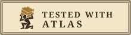 | 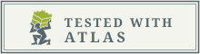 | 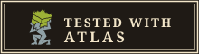 |
| square, 160x160 | 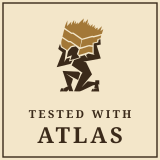 | 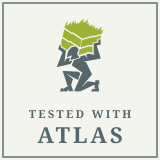 | 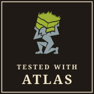 |
| seal, 112x112 | 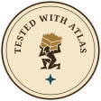 | 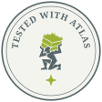 | 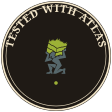 |
| wide, 600x100 | 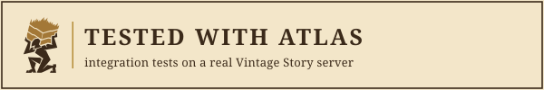 | 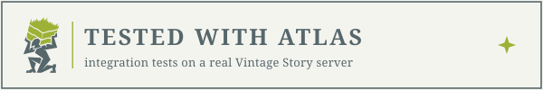 | 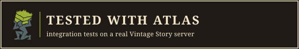 |

- **sepia**: the old-map register of the [Mod DB page](../moddb/README.md), parchment
  ground and dark sepia ink, the titan tinted the same way as `titan-sepia.png`. Pick this
  one for the Mod DB page itself.
- **classic**: the Atlas logo in its own colours (green `#9DB136`, slate `#56676B`) on a
  clean light ground. Pick this one for a GitHub README on the default light theme.
- **dark**: light parchment ink on a deep warm ground. Pick this one for a GitHub README
  viewed in dark mode, or any other dark page.

Where to use which:

- **flat**: a shields.io-style strip, for a README badge row next to the CI and NuGet
  badges.
- **plaque**: a small framed rectangle, for a Mod DB page section.
- **square**: a tile, for a sidebar or a gallery slot.
- **seal**: a round mark, for a page corner or a footer.
- **wide**: a banner strip with a subtitle, for the top or bottom of a Mod DB
  description.

## Snippets

Each snippet below uses the sepia file. Swap `-sepia` for `-classic` or `-dark` in the
file name to change palette; the three are interchangeable, same dimensions, same
wording.

### flat

GitHub README (Markdown):

```md
[](https://github.com/Pixnop/Atlas)
```

Mod DB page (HTML):

```html
<a href="https://github.com/Pixnop/Atlas"></a>
```

Vintage Story forum (BBCode):

```bbcode
[url=https://github.com/Pixnop/Atlas][img]https://raw.githubusercontent.com/Pixnop/Atlas/main/docs/assets/badges/tested-with-atlas-flat-sepia.png[/img][/url]
```

### plaque

```md
[](https://github.com/Pixnop/Atlas)
```

```html
<a href="https://github.com/Pixnop/Atlas"></a>
```

```bbcode
[url=https://github.com/Pixnop/Atlas][img]https://raw.githubusercontent.com/Pixnop/Atlas/main/docs/assets/badges/tested-with-atlas-plaque-sepia.png[/img][/url]
```

### square

```md
[](https://github.com/Pixnop/Atlas)
```

```html
<a href="https://github.com/Pixnop/Atlas"></a>
```

```bbcode
[url=https://github.com/Pixnop/Atlas][img]https://raw.githubusercontent.com/Pixnop/Atlas/main/docs/assets/badges/tested-with-atlas-square-sepia.png[/img][/url]
```

### seal

```md
[](https://github.com/Pixnop/Atlas)
```

```html
<a href="https://github.com/Pixnop/Atlas"></a>
```

```bbcode
[url=https://github.com/Pixnop/Atlas][img]https://raw.githubusercontent.com/Pixnop/Atlas/main/docs/assets/badges/tested-with-atlas-seal-sepia.png[/img][/url]
```

### wide

```md
[](https://github.com/Pixnop/Atlas)
```

```html
<a href="https://github.com/Pixnop/Atlas"></a>
```

```bbcode
[url=https://github.com/Pixnop/Atlas][img]https://raw.githubusercontent.com/Pixnop/Atlas/main/docs/assets/badges/tested-with-atlas-wide-sepia.png[/img][/url]
```

The raw URLs resolve once this branch is merged to `main`. The `@2x` files
(`tested-with-atlas-<format>-<palette>@2x.png`) are there for a page that serves a
`srcset` or a fixed-DPI export; point at those instead if the target supports them. A
plain Markdown image tag has no way to set a display width, so a Markdown
`` pointing at an `@2x` file renders at double size on GitHub. Use the HTML `img`
form with the same `width` attribute as the 1x snippet instead when linking an `@2x`
file.

### Live alternative

A page that would rather not host an image can pull a shields.io badge instead, at the
cost of the Atlas styling:

```md
[](https://github.com/Pixnop/Atlas)
```

## Fonts

Set in [Noto Serif](https://fonts.google.com/noto/specimen/Noto+Serif), under the SIL
Open Font License. The wordmarks are baked into outline paths in the shipped `.svg`
files, so viewing them needs no font installed. Regenerating the kit needs Noto Serif on
the machine that runs `generate.py`; without it, the script falls back to whatever serif
fontconfig resolves to (DejaVu Serif or Liberation Serif, for example).

## Regenerating

```sh
python3 docs/assets/badges/generate.py
```

Needs `inkscape` (to bake the wordmarks to outline paths, `--export-text-to-path
--export-plain-svg`) and `rsvg-convert` (to rasterise the `.png` files) on `PATH`. Output
goes next to the script, overwriting the existing badge files.
